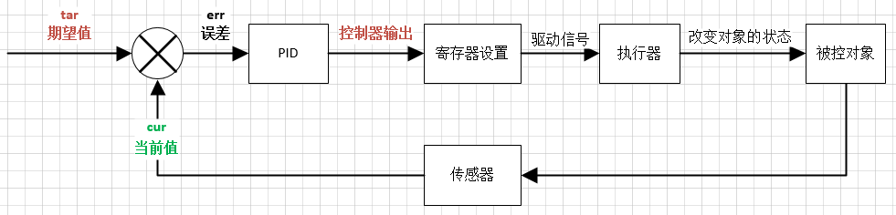

# 模型预测控制(Model Predictive Control, MPC)
每个控制周期，MPC 通过求解优化问题来确定控制输入,同时满足输入和输出的约束条件。

**模型预测控制（MPC）最突出的优点是其处理约束的灵活性，这使其成为解决复杂工业过程中多变量控制问题的最有效方法。**

### 1. 什么是模型预测控制（MPC）？

*   **使用模型 (Model):** MPC的核心是拥有一个过程的数学模型（例如，状态空间模型或阶跃响应模型）。这个模型能够预测系统未来的动态行为。
*   **预测未来 (Predictive):** 在每个控制时刻，MPC利用这个模型来预测系统在未来一段时间内的响应。
*   **优化控制 (Control):** MPC通过求解一个在线优化问题，计算出一系列未来的控制动作（例如，阀门开度变化），其目标是使系统未来的输出尽可能地接近期望值（设定点），同时满足各种约束条件。
*   **滚动优化 (Receding Horizon):** 虽然它计算出了一连串的未来控制动作，但它**只执行第一个**。在下一个时刻，它会获取新的测量值，并重新进行上述的“预测-优化”过程。不断“重新规划”的机制使得MPC能够应对干扰和模型不确定性。

### 2. 为什么MPC如此重要？

*   **强大的约束处理能力：** 在实际工业生产中，系统总是受到各种约束，比如阀门不能开到100%以上、产品的某个指标必须在某个范围内等。传统的控制方法处理这些约束通常很困难且效果不佳，而MPC可以将这些约束作为优化问题的“边界条件”直接、系统地处理。
*   **天然适用于多变量系统 (MIMO)：** 现代工业过程往往是“牵一发而动全身”的，即一个控制输入会影响多个输出变量。MPC的框架天然就是为多变量系统设计的，能够协调地控制所有输入，以达到全局最优的效果。
*   **处理复杂动态：** 对于具有大时滞、非最小相位等复杂动态特性的系统，MPC也能够通过其预测机制进行有效控制。

### 3. MPC的主要算法与理论框架

*   **动态矩阵控制 (DMC, Dynamic Matrix Control):** 使用过程的阶跃响应模型。
*   **模型算法控制 (MAC, Model Algorithmic Control):** 使用过程的脉冲响应模型。
*   **与内模控制 (IMC) 的关系：** 在没有约束的情况下，MPC的结构等价于内模控制（IMC）。将MPC这个看似独立的优化方法与经典的控制理论联系起来，可以运用IMC的成熟理论工具来分析MPC的稳定性与鲁棒性。
*   **与线性二次型控制 (LQC) 的比较：** 无约束的MPC与LQC在数学上是紧密相关的。MPC的真正优势在于当**约束**起作用时，这是传统LQC难以处理的。

# 欠驱动机器人

# 大语言模型在机器人学中的应用

### 主要解决的问题

自动驾驶系统越来越多地利用大型语言模型来理解复杂的驾驶环境并与乘客互动。然而，这带来了一些严重的问题：

1.  **数据安全和隐私风险**：为了让LLM做出决策，车辆需要将大量敏感数据（如精确位置、摄像头图像、雷达点云数据和个人信息）上传到云端的LLM进行处理。
2.  **LLM的不可靠性**：LLMs本身存在一些固有缺陷，比如可能会产生“幻觉”、存在偏见或被恶意输入（“提示注入攻击”）所欺骗。
3.  **对齐问题**：LLM的决策输出可能不完全符合当地的交通法规或人类的价值观。

研究人员提出了一个新颖的、基于多智能体的**安全框架**。这个框架的核心思想是在车辆和云端LLM之间建立一个“安全护栏”。

对比不安全的框架和新框架：

*   **(a) 不安全的框架**：车辆直接将所有数据打包发送给LLM，然后直接执行LLM的指令。这种方式简单直接，但风险极高。
*   **(b) 论文提出的安全框架**：在这个新框架中，数据和指令的流动被几个关键的智能体所管理和审查：
    *   **数据管理器 (Data Manager)**：负责过滤和审查车辆收集到的敏感数据，只将必要且安全的信息发送给LLM。
    *   **提示管理器 (Prompt Manager)**：管理发送给LLM的查询指令，防止恶意或不当的输入。
    *   **评估器 (Evaluator)**：对LLM返回的决策进行审查和验证，确保其符合安全标准、交通法规和人类价值观，然后才将安全的指令传递给车辆执行。

研究人利用他们提出的框架**评估了当前已有的11种主流的LLM自动驾驶方法**（例如Agent-Driver, DriveGPT4, DLAH等）。他们从以下几个维度进行了分析：

*   **驾驶安全率**：模型的决策有多安全。
*   **敏感数据使用量**：模型在系统提示（system prompt）中使用了多少敏感数据。
*   **Token成本**：模型的计算效率如何，Token数量越少越高效。
*   **对齐度排名**：模型的驾驶习惯与人类驾驶员的相似程度。

*   **性能与安全之间的权衡**：研究发现，不同的模型在各项指标上表现各异，存在明显的权衡。例如，“Agent-Driver”模型在安全性上得分最高（99.13%），但其对齐度和数据使用量也较高。而“WayveDriver”模型的效率最高（Token成本最低），但安全性得分相对较低。
*   **GPT-4模型的平衡性**：采用GPT-4作为核心的“SurrealDriver”和“DriveLLM”在安全性和效率之间取得了较好的平衡。
*   **感知能力评估**：研究人员还使用nuScenes-QA数据集测试了这些模型对驾驶环境的感知和理解能力。结果表明，大多数模型在回答“存在性”（比如“有没有行人？”）和“状态”这类简单问题时表现较好，但在需要“计数”或“比较”等更复杂推理的任务上表现较差。

# VLA模型

### 核心思想：什么是 VLA 模型？

VLA 模型是一种能够**接收视觉和语言输入，并据此生成具体动作**的AI模型。

*   **视觉 (Vision):** 模型通过摄像头等传感器观察物理世界，理解物体的状态、位置和环境布局。
*   **语言 (Language):** 模型能理解人类用自然语言下达的指令，例如“请帮我把桌上的红苹果拿过来”。
*   **动作 (Action):** 模型能控制机器人等物理实体，规划并执行一系列动作来完成指令，例如移动手臂、抓取苹果、递给用户。

VLA 模型的目标是让AI代理能够像人一样，通过观察和沟通，在真实世界中执行复杂的任务。

VLA 模型的研究分为了三个主要方向：

1.  **关键组件:** 
    *   **预训练视觉表示 (Pretrained Visual Representations):** 如何训练出更强大的“眼睛”，让模型更好地理解图像和视频内容。
    *   **动力学学习 (Dynamics Learning):** 让模型理解物理规律，比如一个物体被推动后会如何运动。
    *   **世界模型 (World Models):** 让模型在“脑海”中对世界进行模拟和推演，从而进行更长远的规划。

2.  **底层控制策略 (Low-level Control Policies):** 模型的“肌肉记忆”和执行能力。这类模型接收具体的指令（如“拿起杯子”），并直接输出机器人手臂的精确动作序列。不同的实现架构：
    *   基于 Transformer 的模型。
    *   基于扩散模型 (Diffusion Models) 的策略。
    *   以及最新的基于大语言模型 (LLM-based) 的控制策略。

3.  **高层任务规划器 (High-level Task Planners):** 这部分关注的是模型的“大脑”或规划能力。当面对一个复杂、长期的任务时（如“打扫整个房间”），任务规划器负责将其分解成一系列简单的子任务。然后，这些简单的子任务再交由底层的控制策略去执行。

*   **分层架构是主流：** 目前大多数先进的机器人系统都采用“高层规划+底层控制”的分层架构。高层利用大语言模型强大的推理能力进行任务分解，底层则专注于精确、快速地执行动作。
*   **大模型驱动：** VLA 模型的发展深度受益于大语言模型和视觉基础模型的进步。如何将这些大模型的能力迁移到机器人控制上，是当前的研究热点。
*   **数据是瓶颈：** 与互联网上的文本和图像数据相比，高质量的机器人交互数据（即带有动作标签的视觉和语言数据）非常稀缺且难以获取。因此，**数据集、模拟器和基准测试**的建设至关重要。

该领域面临的主要挑战和未来的研究方向：

*   **挑战:**
    *   **模拟到现实的鸿沟 (Sim-to-Real Gap):** 在模拟器中训练好的模型，在真实机器人上表现往往会打折扣。
    *   **泛化能力:** 如何让模型能够处理在训练中从未见过的物体、指令和环境。
*   **未来方向:**
    *   **机器人基础模型 (Foundation Models for Robotics):** 研发一个能适用于多种不同机器人和任务的通用基础模型。
    *   **更丰富的多模态融合 (Richer Multi-modality):** 除了视觉和语言，未来还可能融合触觉、听觉等更多模态的信息。

# 计算机视觉

## 三维视觉

3D生成分为四个主要的算法范式：

*   **前馈生成（Feedforward Generation）：** 直接使用生成模型（如生成对抗网络 (GANs)、扩散模型、自回归模型、变分自编码器 (VAEs) 和归一化流）来生成3D表示。
*   **基于优化的生成（Optimization-Based Generation）：** 这些方法通过运行时优化来生成3D模型，通常利用预训练的多模态网络，根据用户指定的提示（例如，文本到3D或图像到3D）优化3D模型。
*   **程序生成（Procedural Generation）：** 这涉及使用一系列规则（如分形几何、L-系统、噪声函数和元胞自动机）来创建3D模型和纹理。
*   **生成式新视图合成（Generative Novel View Synthesis）：** 这类方法侧重于从单个输入图像预测新视图，通常通过调节3D信息来使用3D感知方法，而不明确利用3D表示来强制执行3D一致性。

### 人类3维视觉
人类的3维视觉主要通过双眼视差实现。此外，人类还利用以下线索感知3维空间：
- **运动视差**：当头部或物体移动时，近处物体比远处物体移动得更快。
- **遮挡**：近物体会遮挡远物体。
- **透视**：平行线会在远处汇聚。
- **阴影和光照**：光影变化暗示物体的形状和深度。

### 机器3维视觉
在计算机和机器人领域，3维视觉是通过传感器和算法实现的，常见技术包括：
- **立体视觉（Stereo Vision）**：使用两个摄像头模拟人眼，通过图像差异计算深度。
- **结构光（Structured Light）**：投射特定光图案（如红外条纹）到物体上，通过图案变形计算3维形状。
- **激光雷达（LiDAR）**：发射激光并测量反射时间，直接获取高精度的3维点云数据。
- **时间飞行（ToF）**：通过测量光从发射到反射回来的时间计算距离。

### 挑战
- **光照变化**：强光、弱光或反光表面会影响传感器性能。
- **遮挡问题**：物体被部分遮挡时，难以完整重建。
- **计算复杂度**：实时处理大量3维数据需要强大的计算能力。

## 四维视觉

利用大语言模型进行视频理解（Video Understanding）的最新研究进展。这类模型通常被称为 **Vid-LLMs**。

**第一个维度：根据视频信息的处理方式，分为三大框架：**

1.  **视频分析器 × LLM (Video Analyzer × LLM)**：
    *   **工作原理**：首先使用独立的“视频分析器”模块（如视频字幕生成模型、目标检测模型、语音识别模型等）将视频内容转换成纯文本描述，然后将文本信息被输入给LLM进行后续的推理和问答。
    *   **特点**：LLM不直接“看”视频，而是“阅读”关于视频的报告。这种方法实现简单，可以利用现成的强大LLM，但可能会丢失视频中的细节信息。

2.  **视频嵌入器 × LLM (Video Embedder × LLM)**：
    *   **工作原理**：这种框架使用一个“视频嵌入器”（通常是视觉编码器，如ViT或CLIP）将视频帧转换成一系列数字向量。然后通过一个适配器（Adapter）将这些视觉向量对齐并输入给LLM。
    *   **特点**：LLM直接处理来自视频的视觉特征，能够更好地捕捉视觉细节。这是目前最主流的研究方向，但需要对模型进行端到端的训练或微调。

3.  **（分析器 + 嵌入器）× LLM (Analyzer + Embedder) × LLM**：
    *   **工作原理**：这是一个混合框架，同时为LLM提供来自视频的文本描述和视觉向量。
    *   **特点**：结合了前两种方法的优点，理论上能提供最全面的信息，但结构也最复杂。

**第二个维度：根据LLM在系统中的功能，分为五种角色：**

*   **LLM作为总结器 (Summarizer)**：LLM接收处理后的视频信息，并根据指令生成摘要、回答问题。信息流是单向的。
*   **LLM作为管理器 (Manager)**：LLM扮演一个“指挥官”的角色，可以主动调用不同的工具（视频分析器）来获取信息，并与工具进行多轮交互来解决复杂问题。
*   **LLM作为文本解码器 (Text Decoder)**：这是最常见的角色，LLM将输入的视频向量解码为自然语言文本输出。
*   **LLM作为回归器 (Regressor)**：除了生成文本，LLM还能预测连续值，例如视频中某个事件发生的时间戳或物体的位置坐标。
*   **LLM作为隐藏层 (Hidden Layer)**：LLM的输出不直接作为最终结果，而是作为中间特征，再送入一个专门的任务头（task-specific head）来完成特定任务（如定位）。

### 3. 视频理解技术的发展脉络

1.  **传统方法**：依赖于手工设计的特征，如SIFT、HOG等。
2.  **早期神经网络模型**：使用CNN和RNN（如LSTM）来处理视频，例如双流网络（Two-stream Networks）。
3.  **自监督视频预训练 (Self-supervised Video Pretraining)**：通过自监督学习（如VideoBERT、VideoMAE）在大规模无标签视频数据上预训练模型，使其具备更强的泛化能力。
4.  **用于视频理解的大语言模型 (Vid-LLMs)**：将强大的LLM引入，使模型不仅能识别内容，更能进行复杂的推理、交互和开放式回答，标志着视频理解进入了一个新的范式。

### 4. 任务、基准和评估

论文详细梳理了视频理解领域的各种任务，并将其分为三类：
*   **抽象理解任务 (Abstract Understanding)**：如视频分类、视频字幕生成、文本-视频检索等。
*   **时序理解任务 (Temporal Understanding)**：如时序动作定位、视频摘要、事件边界检测等。
*   **时空理解任务 (Spatiotemporal Understanding)**：如目标跟踪、视频对象分割、时空定位等。

**未来挑战**：
1.  **更细粒度的理解**：如何理解更细微的动作、情感和场景动态。
2.  **长视频理解**：如何高效处理数小时的长视频并保持对关键信息的记忆。
3.  **多模态融合**：如何更好地融合视频中的视觉、音频、文本等多模态信息。
4.  **模型幻觉 (Hallucination)**：如何减少模型“凭空捏造”不符合视频事实的内容。

## 视觉提示

## 可供性锚定

1. 可供性锚定的形式化定义与评测指标；  
2. 基于大模型/VLM 的 2-D/3-D 锚定网络结构；  
3. 锚定误差对机器人抓取或操作成功率的实证分析。  

在具身智能文献中，“可供性锚定（affordance anchoring）”指的是：  
把抽象的动作语义（“可以抓”“可以坐”或自然语言指令）精确映射到感知信号中的**具体空间-物理单元**——例如图像像素、2-D/3-D 关键点、点云片或物体部件——从而让“可供性”不再是对象级标签，而成为**可坐标化、可度量、可执行**的机器人接口。简言之，它回答“可以怎么做”之后，还要回答“在哪儿做、以什么姿态做”。

1. **可供性（Affordance）**  
   环境-物体相对于**特定智能体**提供的潜在交互方式；同一物体对不同本体（人 vs 双指夹爪 vs 五指手）具有不同可供性。

2. **锚定（Anchoring / Grounding）**  
   在实时感知流中**持续保持**“语义 ⇄ 物理位姿”对应关系，使高层符号能随物体移动、遮挡、变形而更新，而不丢失身份与意义。

3. **具身智能中的闭环**  
   感知 → 锚定可供性区域 → 生成动作/轨迹 → 执行并观测结果 → 更新锚定；利用身体反馈不断修正“哪里可交互”。

### 锚定到哪一层？——主流表征粒度

| 粒度 | 输出形式 | 典型方法 | 适用场景 |
|---|---|---|---|
| 像素级 | 2-D 热力图 / 掩膜 | AffordanceLLM, Cross-View-AG | 平面抓取、推拨 |
| 关键点 | 2-D/3-D 点坐标 | KITE, Robo-ABC | 开抽屉、按按钮 |
| 区域-部件 | 3-D 部件分割 + 向量/面片 | CoPa, SceneFun3D | 家具拆装、工具使用 |
| 语义-技能 | 可执行原语索引 | VoxPoser, Affordance Functions | 语言指令→技能序列 |

### 算法流程（以视觉-语言输入为例）

1. **多模态编码**  
   视觉流：RGB-D、点云 → 视觉骨干(ViT, PointNet++)  
   语言流：指令或标签 → 大语言模型 / CLIP 文本编码器

2. **跨模态对齐**  
   使用对比学习或注意力把“可抓”等文本嵌入与空间特征做相似度匹配，生成**密集相似度张量**。

3. **锚定解码**  
   上采样到与原图/点云相同分辨率 → 经过 Spatial- softmax 得到 2-D/3-D 概率图；取峰值或采样即得坐标+法向+接触力方向。

4. **时序滤波 / 身份维持**  
   引入轻量级跟踪（Kalman 或粒子滤波）或对象级 ID，使同一物体在遮挡再出现后锚定不漂移。

### 四、与“可供性检测”或“grounding”区别

| 维度 | 传统检测 | 可供性锚定 |
|---|---|---|
| 输出 | 类别或 bbox | 精确 6-DoF 接触姿态 |
| 监督 | 强标签（人工框） | 弱/零样本，可自监督 |
| 时序 | 单帧 | 多帧一致性，需跟踪 |
| 闭环 | 开环感知 | 与动作、力控耦合 |

### 六、前沿趋势

1. **大模型即锚定器**  
   利用 VLM 的丰富先验实现“一句话”零样本锚定。
2. **机器人-感知- aware**  
   把夹爪几何、工作空间限界直接注入网络，输出“对本机器人可执行”的专属可供性。
3. **4-D 时空锚定**  
   在动态场景里同时锚定“何时 + 何地”可交互（例如摆动中的锤子柄），结合时序扩散策略做预测。
4. **语言→价值图→控制**  
   VoxPoser 等直接生成 3-D 价值场，跳过显式坐标，一步完成锚定与运动规划。

# 机器人巡航

# 自动驾驶

## 自动驾驶策略

### 核心思想：从模块化到端到端

传统的自动驾驶系统是**模块化**的，就像一条工厂流水线。它包含多个独立的模块，比如：
1.  **感知模块**：识别摄像头、雷达等传感器数据中的物体。
2.  **预测模块**：预测其他道路使用者的未来轨迹。
3.  **规划模块**：根据感知和预测结果，规划出一条安全的行驶路径。
4.  **控制模块**：执行规划好的路径，输出具体的转向、油门和刹车指令。

这种方法的优点是每个模块职责清晰，便于调试。但缺点也很明显：每个模块独立优化，目标不统一，错误会在流水线中逐级累积和放大，最终可能导致规划失误。

而**端到端 (End-to-end)** 方法则试图打破这些模块间的壁垒。它构建一个统一的、通常是基于深度学习的模型，直接将原始的传感器数据（如图像、点云）作为输入，然后直接输出车辆的驾驶决策（如行驶轨迹或控制指令）。

端到端系统的核心优势在于**联合优化**。整个系统为了一个共同的目标（即最终的安全、舒适驾驶）进行训练，可以更有效地学习特征，减少信息损失，并可能提高计算效率。

1.  **模仿学习 (Imitation Learning, IL)**：让模型像学生一样模仿“专家”（通常是人类驾驶员）的行为。这是目前最主流的方法，因为它相对简单且数据驱动。它主要包括行为克隆 (Behavior Cloning) 和逆向最优控制 (Inverse Optimal Control)。
2.  **强化学习 (Reinforcement Learning, RL)**：让模型像新手一样在模拟环境中通过不断试错来学习。系统通过奖励（如安全到达目的地）和惩罚（如发生碰撞）来优化其驾驶策略。这种方法潜力巨大，但对高质量模拟环境的依赖性很强，且训练成本高昂。

端到端自动驾驶面临的严峻挑战，主要包括：

*   **可解释性 (Interpretability)**：端到端模型通常像一个“黑盒子”，我们很难理解它做出某个决策的具体原因。这对于需要高度安全和信任的自动驾驶系统来说是致命的。
*   **因果混淆 (Causal Confusion)**：模型可能会学到错误的因果关系。论文中举了一个例子：车辆在红灯前停下，模型可能错误地认为“刹车”是因为“车速为零”，而不是因为它看到了“红灯”。这种虚假的关联在真实驾驶中非常危险。
*   **鲁棒性与泛化能力 (Robustness / Generalization)**：如何确保模型在训练数据中很少出现的罕见场景（即“长尾问题”）、恶劣天气或全新地理环境中依然能可靠工作，这是一个巨大的挑战。
*   **安全性保证 (Safety Guarantee)**：与传统基于规则的系统不同，基于学习的端到端模型天生缺乏严格的数学安全保证，这使得验证和部署变得极为困难。
*   **多传感器融合 (Multi-sensor Fusion)**：如何有效、优雅地融合来自摄像头、激光雷达、毫米波雷达等不同传感器的信息，充分利用各自的优势，仍然是一个开放性问题。

未来趋势

*   **模块化的端到端规划 (Modular End-to-end Planning)**：在保留部分模块化设计（以增强可解释性）的同时，享受端到端联合优化的好处。
*   **数据引擎 (Data Engine)**：构建自动化、大规模的数据闭环系统至关重要。这不仅包括数据的收集和标注，还包括对疑难场景（corner cases）的挖掘和利用，从而驱动模型持续迭代和改进。
*   **基础模型 (Foundation Models)**：探索如何将视觉和语言领域的大型基础模型的能力迁移到自动驾驶任务中，可能会为高级别的场景理解和决策推理带来突破。

### 快系统

这篇题为“规划导向的自动驾驶”（UniAD）的论文介绍了一个全面的自动驾驶框架，该框架将全栈驾驶任务整合到一个网络中，并将规划作为最终目标。作者认为，传统的模块化方法存在累积误差和任务协调不足的问题，而现有的端到端方法要么直接优化规划但缺乏足够的感知/预测监督，要么只部分整合了必要的组件。

UniAD 通过精心设计感知和预测模块来解决这些局限性，以从全局角度为代理交互提供互补的特征抽象。它使用统一的查询接口来促进任务之间的通信，所有这些都旨在服务于规划。该框架在 nuScenes 基准上进行了评估，在各个方面都显著优于之前的最新技术。

该论文的一些主要观点包括：

*   **规划导向的理念**：UniAD 建立在所有感知和预测任务都应以实现自动驾驶汽车的规划为最终目标进行设计和优化的理念之上。
*   **统一的基于查询的设计**：UniAD 的核心组件是其基于查询的设计，它充当连接各种模块（感知、预测和规划）的灵活接口。这些查询有助于建模多个代理之间的复杂交互以及跨任务的信息流。
*   **全面的端到端系统**：UniAD 将广泛的任务整合到一个网络中，包括 3D 目标检测、多目标跟踪、在线地图构建、运动预测和占用预测。这种集成旨在减少累积误差并改善任务协调。
*   **模块化设计与联合优化**：UniAD 作为一个端到端系统，仍然利用了各个模块的优势。感知和预测模块基于 Transformer 解码器结构，其中包括用于检测和跟踪的 TrackFormer、用于道路元素全景分割的 MapFormer、用于多代理轨迹预测的 MotionFormer 和用于多步占用预测的 OccFormer。
*   **卓越的性能**：该论文在 nuScenes 数据集上进行了广泛的消融实验和实验结果，表明 UniAD 在跟踪、地图构建、运动预测、占用预测和规划等所有关键指标上均显著优于以往方法。
*   **强调安全性**：UniAD 中的规划模块通过优化轨迹以避免碰撞，并利用以代理为中心的运动预测和全场景占用预测来优先考虑安全性。

作者希望这项工作能够鼓励自动驾驶系统的目标驱动设计理念，从而促进各种驾驶任务之间更好的协调。

您想进一步讨论论文的任何具体方面，或者想让我详细阐述某个特定部分吗？

### 慢系统

这篇论文的核心思想是：将大型视觉语言模型（VLM）的强大场景理解和推理能力，与传统自动驾驶系统的精确、高效规划能力相结合，以解决自动驾驶在复杂、长尾场景（long-tail scenarios）中面临的挑战。

为了实现这个目标，研究者们提出了两个系统：**DriveVLM** 和 **DriveVLM-Dual**。

传统的自动驾驶系统通常由“感知-预测-规划”三个独立的模块构成。这种系统在处理标准路况时表现不错，但在面对一些复杂和不可预测的场景时（例如：施工区域、交警指挥、罕见障碍物、恶劣天气等），常常会遇到困难。具体来说：
*   **3D感知**模块可能无法识别罕见物体。
*   **运动预测和规划**模块更侧重于轨迹层面的计算，而忽略了更高层面的决策逻辑和与环境的互动。

近年来，大型视觉语言模型（如GPT-4V）在视觉理解和推理方面展现了惊人的能力。研究者们认为，这种能力可以被用来弥补传统自动驾驶系统在“场景理解”上的短板。

### 2. DriveVLM：基于VLM的自动驾驶系统

研究者首先提出了一个纯粹基于VLM的系统，名为 **DriveVLM**。它的工作流程类似于人类的“思考链”，分为三个步骤（可以参考论文中的图1）：

1.  **场景描述 (Scene Description)**：VLM首先用语言描述当前的驾驶环境（如天气、时间、道路类型）并识别出场景中的关键物体（如前方有警车）。
2.  **场景分析 (Scene Analysis)**：接着，VLM会分析这些关键物体的特征及其对本车可能产生的影响（例如：警车停在路边，堵塞了右侧车道，可能预示着前方有事故）。
3.  **分层规划 (Hierarchical Planning)**：最后，VLM会分层次地制定驾驶计划，从宏观的“元操作”（meta-actions，如减速、向右微调），到更具体的决策描述（如“减速并向右微调以绕过障碍物”），最终生成具体的行驶轨迹点。

### 3. DriveVLM-Dual：融合VLM与传统系统的混合方案

尽管DriveVLM在理解层面很强大，但它有两个主要缺点：
*   VLM在精确的空间定位和运动推理方面能力较弱。
*   VLM的计算量巨大，推理速度慢，难以满足自动驾驶实时性的要求。

为了解决这些问题，研究者提出了 **DriveVLM-Dual**，一个混合系统。这个系统的设计灵感来源于人脑的“快思慢想”双系统理论：

*   **慢思考系统 (Slow System)**：由 **DriveVLM** 担任。它以较低的频率运行，负责处理复杂的场景，进行深入的分析和决策，为车辆提供宏观的、战略性的规划指导（例如，告诉车辆应该绕行）。
*   **快思考系统 (Fast System)**：由**传统的自动驾驶 pipeline**（3D感知、运动预测、轨迹规划模块）担任。它以高频率运行，负责执行具体的、战术性的任务，如精确地检测物体、预测轨迹，并根据DriveVLM的指导实时优化和生成平滑、安全的行驶轨迹。

通过这种方式，DriveVLM-Dual 结合了VLM的“智慧”和传统系统的“效率”，实现了优势互补。

### 4. 数据集和实验结果

为了更好地评估模型在场景理解和规划方面的能力，研究者还做出了两项贡献：
1.  **定义了新的任务**：场景理解与规划（Scene Understanding for Planning, SUP）任务。
2.  **构建了新的数据集**：**SUP-AD** 数据集。这个数据集通过挖掘大量真实驾驶数据中的长尾和复杂场景（如施工、动物穿行、异形车辆等）来构建，专门用于训练和评估模型应对这些挑战的能力。

实验结果表明：
*   在SUP-AD数据集上，DriveVLM的效果明显优于其他VLM模型（包括GPT-4V）。
*   在公开的nuScenes数据集上，DriveVLM-Dual与当时最先进的模型结合后，取得了顶尖的性能，尤其是在规划任务的碰撞率和误差指标上表现出色。
*   研究者最终成功地将DriveVLM-Dual部署到了一辆量产测试车上，验证了其在真实世界中的有效性。

### 总结

这篇论文提出了一个创新的自动驾驶框架，通过将大型视觉语言模型的推理能力与传统自动驾驶流水线的精确执行能力相融合，有效地提升了自动驾驶系统在复杂和长尾场景下的安全性和可靠性。DriveVLM-Dual模型的设计，特别是其“快思慢想”的混合架构，为未来自动驾驶技术的发展提供了一个非常有前景的方向。

