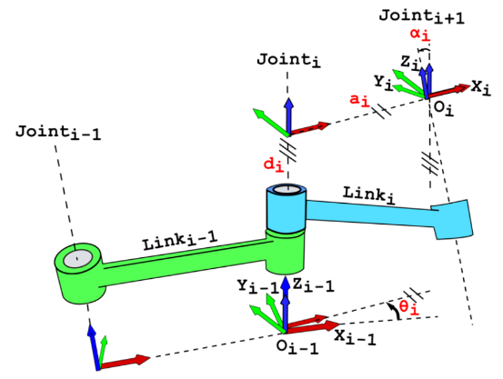

[**机器人学简介**](https://github.com/TianxingChen/Embodied-AI-Guide/blob/main/files/%E6%9C%BA%E5%99%A8%E4%BA%BA%E5%AD%A6%E7%AE%80%E4%BB%8B.pdf)

# 运动学

## 正运动学

### 旋转矩阵

$$
R = R_z(\gamma) R_y(\beta) R_x(\alpha) =
\begin{bmatrix}
\cos \gamma & -\sin \gamma & 0 \\
\sin \gamma & \cos \gamma & 0 \\
0 & 0 & 1
\end{bmatrix}
\begin{bmatrix}
\cos \beta & 0 & \sin \beta \\
0 & 1 & 0 \\
-\sin \beta & 0 & \cos \beta
\end{bmatrix}
\begin{bmatrix}
1 & 0 & 0 \\
0 & \cos \alpha & -\sin \alpha \\
0 & \sin \alpha & \cos \alpha
\end{bmatrix}
$$

其中 $\alpha$ ， $\beta$ ， $\gamma$ 分别表示欧拉角中的横滚roll、俯仰ptich、偏航yaw

* $R^T R = I$，即 $R^T = R^{-1}$
* $\det R$ = $\pm 1$ 

### 齐次变换矩阵

### D-H参数

* $d_i$：沿 $z_{i-1}$ 轴移动的距离
* $\theta_i$：绕 $z_{i-1}$ 轴旋转的角度
* $a_i$：沿 $x_i$ 轴移动的距离
* $\alpha _i$：绕 $x_i$ 轴旋转的角度

### DROP-A6 D-H参数

### 雅可比矩阵

$$
\dot{T} = J(q)\dot{q}
$$

其中 $J(q)\in R^{6\times n}$ 表示雅可比矩阵，表示关节空间关节速度与任务空间末端速度之间的转换关系

关节力矩 $\tau$ 和末端广义力 $F$ 之间的转换关系

$$
\tau = J^T (q)F
$$

## 逆运动学

逆运动学主要描述从任务空间到关节空间的一种坐标变换 $T^{-1}_r:X\in R^{6\times 1} \to q\in R^{n\times 1}$，逆运动学直接告诉了机器人如果要将末端运动到任务空间中的某一指定位姿 $X$ ，则需要将关节位置运动到 $q=T^{-1}_r(X)$

### 解析解：Pieper准则

### 数值解：Newton Raphson迭代

# 轨迹规划

## 三次多项式拟合

## 关节速度控制器设计

# 动力学

机器人动力学主要描述关节力矩如何影响关节加速度从而驱使机器人运动

$$
\tau = M(q)\ddot{q} + C(q,\dot{q})\dot{q} + G(q)
$$

其中 $M(q)\in R^{n\times n}$ 表示广义质量矩阵， $C(q,\dot{q})\in R^{n\times n}$ 表示柯氏力以及摩擦力， $G(q)\in R^{n\times 1}$ 表示重力矩阵

* $M(q) = M^T(q)$
* $\dot{M}(q) = C(q,\dot{q}) + C^T(q,\dot{q})$

## 动力学辨识

### 最小惯性参数集

### 最小二乘

## 计算力矩控制

### 零力控制

### 轨迹跟踪

## 碰撞检测

### 直接力矩检查

### 动量积分观测器

## 力控制

### 直接力控制

### 力位混合控制

# 视觉感知

## 2D感知

$$
\begin{cases} 
u = f\frac{X}{Z} \\
v = f\frac{Y}{Z}
\end{cases}
$$

其中 $(u,v)$ 是图片像素点的坐标表示， $(X,Y,Z)$ 是真实物体在相机体系下的三维坐标， $f$ 表示焦距， $Z$ 表示物距

## 3D感知

能直接获取物距 $Z$
